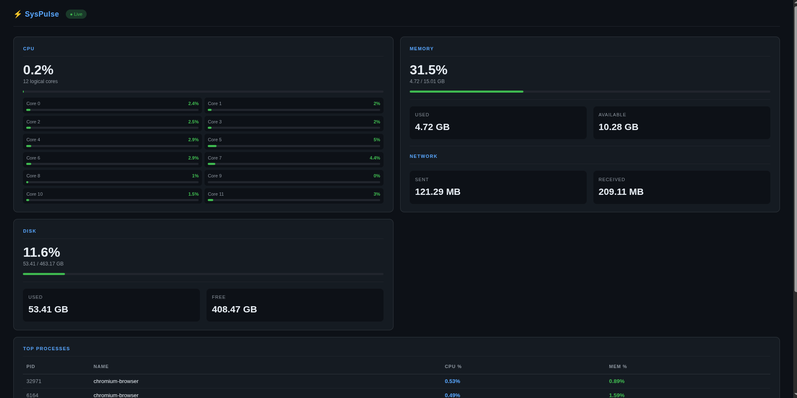
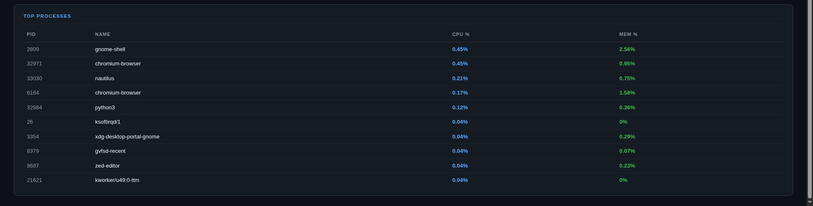

# ⚡ SysPulse

Real-time system monitoring dashboard built with FastAPI, WebSockets, and psutil.

Streams live CPU, memory, disk, network, and process metrics directly to your browser with real-time updates.


---

## 📸 Screenshots

### Dashboard Overview



### Process Monitoring



---

## Features

* Real-time CPU monitoring
* Per-core CPU utilization
* Memory usage statistics
* Disk usage statistics
* Network traffic monitoring
* Top processes by CPU and memory usage
* Live WebSocket updates
* Responsive dashboard UI
* Docker / Podman support

---

## Tech Stack

| Layer            | Technology            |
| ---------------- | --------------------- |
| Backend          | FastAPI               |
| Runtime          | Python                |
| Real-Time        | WebSockets            |
| Metrics          | psutil                |
| Frontend         | HTML, CSS, JavaScript |
| Containerization | Docker, Podman        |

---

## Quick Start

### Docker

```bash
docker run -p 8000:8000 yashg0/syspulse:latest
```

### Podman

```bash
podman run -p 8000:8000 docker.io/yashg0/syspulse:latest
```

Open:

```text
http://localhost:8000
```

---

## Local Development

```bash
git clone https://github.com/yashg0/syspulse.git

cd syspulse

uv sync

uv run uvicorn app.main:app --reload
```

---

## API

| Method    | Endpoint      | Description         |
| --------- | ------------- | ------------------- |
| GET       | `/`           | Dashboard UI        |
| WebSocket | `/ws/monitor` | Live metrics stream |

---

## Project Structure

```text
syspulse/
├── app/
│   ├── main.py
│   ├── metrics.py
│   └── ws.py
├── static/
│   └── index.html
├── screenshots/
│   ├── i1.png
│   └── i2.png
├── tests/
│   └── test_metrics.py
├── Dockerfile
├── pyproject.toml
├── uv.lock
└── README.md
```

---

## Roadmap

* [x] CPU Monitoring
* [x] Memory Monitoring
* [x] Disk Monitoring
* [x] Network Monitoring
* [x] Process Monitoring
* [x] Docker Image
* [ ] Historical Metrics Storage
* [ ] Alert System
* [ ] GPU Monitoring
* [ ] Container Monitoring

---

## Docker Hub

```bash
docker pull yashg0/syspulse:latest
```

Docker Hub:
https://hub.docker.com/r/yashg0/syspulse

---

## Author

**Yash G**

GitHub:
https://github.com/yashg0

MIT License
